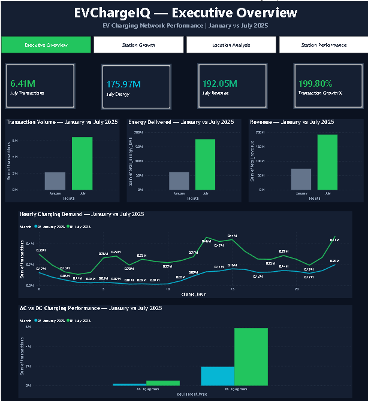
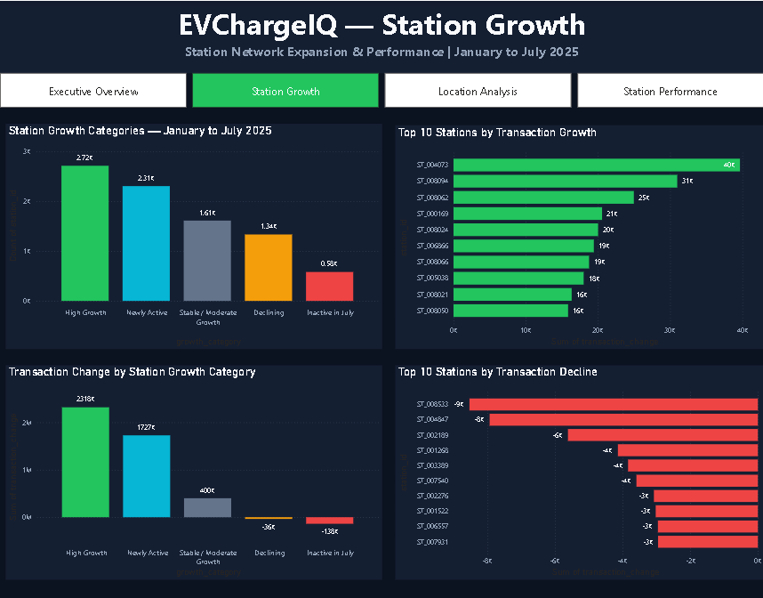
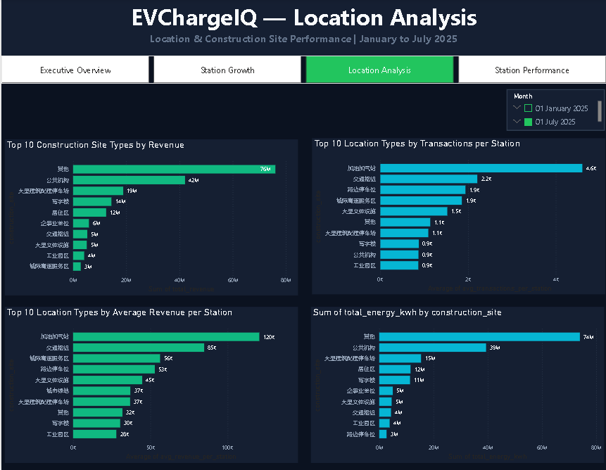
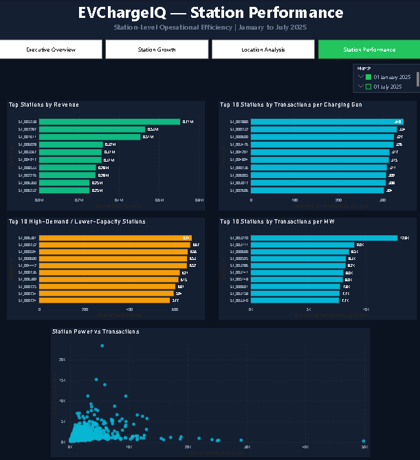

# EVChargeIQ — EV Charging Business Analytics

> **Data-driven analysis of public EV charging demand, station performance, charging economics, and infrastructure utilization using city-scale charging data.**

---

## 📌 Project Overview

**EVChargeIQ** is an end-to-end data analytics and business intelligence project focused on understanding how public electric vehicle charging infrastructure is utilized at city scale.

The project analyzes public EV charging transaction and station infrastructure data from **Beijing, China**, covering **January and July 2025**.

The objective is to transform raw charging data into actionable business insights that can support decisions related to:

- Charging demand
- Station performance
- Infrastructure utilization
- Charging economics
- Location and construction-site performance
- Station growth
- Capacity expansion opportunities
- Operational efficiency

The project combines **Python-based data analysis, feature engineering, business KPI development, and Power BI dashboarding**.

---

## 🎯 Business Problem

As EV adoption increases, charging operators need to understand whether existing infrastructure is being utilized efficiently and where operational improvements may be more valuable than simply adding new charging capacity.

EVChargeIQ aims to answer:

> **When, where, and under what conditions is public EV charging infrastructure most heavily utilized, and what business decisions can be supported by these patterns?**

The analysis focuses on charging activity, station characteristics, infrastructure capacity, revenue, location types, and station-level performance.

---

## 📊 Dataset

The primary dataset is the **city-scale public electric vehicle charging transactions and infrastructure dataset** released by Wang et al. in *Scientific Data* in 2026.

The project uses:

- **8.5M+ charging transactions**
- Approximately **8,553 public charging stations**
- Transaction-level charging records
- Station-level infrastructure attributes
- January 2025 transaction data
- July 2025 transaction data
- Anonymized `station_id` for linking transaction and station information
- Charging energy and duration information
- Electricity and service fee information
- Charging equipment information
- Station infrastructure information
- Anonymized spatial information

### Dataset Scale Used in Analysis

| Dataset | Rows |
|---|---:|
| January 2025 transactions | 2,137,234 |
| July 2025 transactions | 6,407,461 |
| Public stations | 8,553 |
| Total transactions analyzed | 8,544,695 |

### Important Dataset Limitation

The dataset contains observations from **January and July 2025 only**.

Therefore, this project does **not** interpret the data as a complete annual time series or claim full-year seasonal trends.

Instead, January and July are treated as two observed periods for comparative analysis.

### Source

Wang, Q., Liu, S., Su, Z. et al.  
*A city-scale dataset of public electric vehicle charging transactions and infrastructure.*  
*Scientific Data*, 2026.

Dataset DOI:

`10.6084/m9.figshare.31952289`

---

# 🔍 Key Business Questions

## 1. Charging Demand

- When does charging demand peak?
- How does charging activity vary throughout the day?
- How does charging activity differ between January and July?

## 2. Station Performance

- Which stations handle the highest charging activity?
- Which stations generate the highest revenue?
- Which stations have the highest transactions per charging gun?
- Which stations have the highest transactions per MW?

## 3. Infrastructure Utilization

- How efficiently are charging guns and station power capacity being utilized?
- Which stations show strong demand relative to available capacity?
- Which stations may represent capacity-expansion opportunities?

## 4. Charging Economics

- Which stations generate the highest revenue?
- How does revenue vary across location and construction-site types?
- How does charging activity relate to revenue?

## 5. Location Analysis

- Which construction-site types generate the highest revenue?
- Which location types have the highest transactions per station?
- Which location types generate the highest average revenue per station?
- How does energy consumption vary across construction-site types?

## 6. Station Growth

- Which stations show the strongest transaction growth?
- Which stations show declining transaction activity?
- How are stations distributed across growth categories?
- Which stations may require further operational investigation?

---

# 🏗️ Analytical Workflow

```text
Raw EV Charging Data
        ↓
Data Audit
        ↓
Feature Engineering
        ↓
Business KPI Development
        ↓
Station Performance Analysis
        ↓
Station Growth Analysis
        ↓
Location & Construction-Site Analysis
        ↓
Power BI Dashboard
        ↓
Dashboard QA
        ↓
Business Insights & Recommendations
---

# 📈 Completed Analysis

## 1. Data Audit

The data audit established the structure, scale, and availability of the transaction and station datasets.

The analysis validated:

- January 2025 transaction data
- July 2025 transaction data
- Public station infrastructure data
- Transaction and station schemas
- Station identifiers used to connect transaction and infrastructure information
- Key charging and infrastructure attributes

### Dataset Sizes

| Dataset | Rows |
|---|---:|
| January transactions | 2,137,234 |
| July transactions | 6,407,461 |
| Station infrastructure | 8,553 |

---

## 2. Feature Engineering

The project created operational and business-oriented features from the raw charging data.

### Transaction Features

- Transaction date
- Charging start and end time
- Charging duration
- Charging hour
- Day of week
- Day-of-week number
- Weekend indicator
- Month
- Time period
- Total electricity consumed
- Total electricity fee
- Total service fee
- Total transaction fee

### Charging Performance Features

- Average charging power
- Energy per minute
- Electricity cost per kWh
- Service fee share
- Equipment classification
- Equipment type

### Station Infrastructure Features

- Station total power
- Number of piles
- Number of DC piles
- Number of AC piles
- Number of charging guns
- Number of DC charging guns
- Number of AC charging guns
- DC pile share
- DC gun share
- Power per pile

---

# 📊 Business KPI Development

The project developed Power BI-ready datasets covering:

- Executive KPIs
- Hourly charging demand
- Equipment performance
- Construction-site performance
- Station performance
- Station growth

Key metrics include:

- Transaction volume
- Energy delivered
- Revenue
- Charging demand by hour
- Equipment performance
- Construction-site performance
- Station-level revenue
- Station-level transactions
- Transactions per charging gun
- Transactions per MW
- Station growth
- Station capacity
- High-demand / lower-capacity opportunities

---

# 📈 Station Performance Analysis

Station-level analysis was developed to identify differences in operational performance across the charging network.

The analysis includes:

- Total station revenue
- Transaction volume
- Transactions per charging gun
- Transactions per MW
- Station power
- Station infrastructure capacity
- Charging demand
- Revenue performance

### Station Growth Analysis

Stations were analyzed based on changes in transaction activity between the observed January and July periods.

The analysis identifies:

- High-growth stations
- Newly active stations
- Stable/moderate-growth stations
- Declining stations
- Stations inactive in July
- Top transaction-growth stations
- Top transaction-decline stations

---

# 📍 Location & Construction-Site Analysis

The project analyzes charging performance across different location and construction-site categories.

Key metrics include:

- Revenue by construction-site type
- Transactions per station by location type
- Average revenue per station by location type
- Energy consumption by construction-site type

This analysis provides a location-oriented view of charging activity, revenue, and energy consumption.

---

# ⚡ Infrastructure Efficiency Analysis

The project evaluates station demand relative to available infrastructure.

### Transactions per Charging Gun

Measures charging activity relative to the number of charging guns available at a station.

### Transactions per MW

Measures charging activity relative to station power capacity.

### Station Power vs Transactions

Examines the relationship between available station power and observed transaction activity.

### High-Demand / Lower-Capacity Stations

Identifies stations where observed demand is relatively high compared with available capacity.

These stations can be considered candidates for further operational investigation and potential capacity planning.

---

# 📊 Power BI Dashboard

The final EVChargeIQ Power BI dashboard contains four analytical pages.

## 1. Executive Overview

Provides a high-level view of overall charging network performance.

### Included Visuals

- July transaction volume
- July energy delivered
- July revenue
- Transaction growth
- January vs July transaction comparison
- January vs July energy comparison
- January vs July revenue comparison
- Hourly charging demand
- AC vs DC charging performance

---

## 2. Station Growth

Analyzes changes in station activity between January and July 2025.

### Included Visuals

- Station growth categories
- Top 10 stations by transaction growth
- Transaction change by station growth category
- Top 10 stations by transaction decline

---

## 3. Location Analysis

Analyzes charging performance across location and construction-site types.

### Included Visuals

- Top 10 construction-site types by revenue
- Top 10 location types by transactions per station
- Top 10 location types by average revenue per station
- Energy by construction-site type
- Interactive month filtering

---

## 4. Station Performance

Provides detailed station-level operational analysis.

### Included Visuals

- Top stations by revenue
- Top 10 stations by transactions per charging gun
- Station power vs transactions
- Top 10 high-demand / lower-capacity stations
- Top 10 stations by transactions per MW
- Interactive month filtering

---

# 🖼️ Dashboard Preview

The EVChargeIQ Power BI dashboard provides an interactive view of charging network performance across demand, station growth, location performance, and station-level operations.

## Executive Overview



## Station Growth



## Location Analysis



## Station Performance



---
# 🎨 Dashboard Design

The Power BI dashboard uses a consistent EV-focused dark theme.

| Purpose | Color |
|---|---|
| Canvas | `#0B1220` |
| Visual/Card background | `#151F32` |
| Growth | `#22C55E` |
| Energy / Operations | `#06B6D4` |
| Revenue | `#10B981` |
| Opportunity / Attention | `#F59E0B` |
| Decline | `#EF4444` |
| Primary text | `#F8FAFC` |
| Secondary text | `#94A3B8` |
| Gridlines | `#334155` |

### Semantic Color System

- **Green** → Growth and positive performance
- **Cyan** → Charging and operational metrics
- **Emerald** → Revenue and financial metrics
- **Amber** → Capacity or operational opportunities
- **Red** → Declining performance
- **Slate** → Neutral or baseline values

---

# 🛠️ Technology Stack

| Category | Tools |
|---|---|
| Programming | Python |
| Data Manipulation | Pandas, NumPy |
| Data Visualization | Matplotlib |
| Business Intelligence | Power BI |
| Machine Learning | Scikit-learn |
| Notebook Environment | Jupyter / Google Colab |
| Version Control | Git & GitHub |
| Data Format | Parquet |

---

# 📁 Project Structure

```text
EVChargeIQ-1/
│
├── dashboard/
│   └── EVChargeIQ_Dashboard.pbix
│
├── data/
│   └── README.md
│
├── notebooks/
│   ├── EVChargeIQ_01_Data_Audit.ipynb
│   ├── EVChargeIQ_02_Feature_Engineering.ipynb
│   └── EVChargeIQ_03_Business_KPIs.ipynb
│
├── reports/
│
├── sql/
│
├── src/
│
├── README.md
└── .gitignore
---

# 💼 Business Applications

The completed analysis can support decisions related to:

- Identifying high-performing charging stations
- Evaluating station revenue performance
- Understanding peak charging demand
- Measuring transactions per charging gun
- Measuring transactions relative to station power
- Identifying high-demand / lower-capacity stations
- Comparing location performance
- Understanding station growth and decline
- Supporting infrastructure planning
- Improving charging network operational efficiency

Recommendations should be based on observed analytical patterns rather than predefined assumptions.

---

# 🤖 Future Work

The current version focuses primarily on **descriptive and diagnostic analytics**.

Potential future extensions include:

- SQL-based business analysis
- Charging demand forecasting
- Station utilization prediction
- Predictive station performance modeling
- Advanced spatial analysis
- Infrastructure optimization modeling
- Automated dashboard refresh pipelines
- Additional temporal analysis if more monthly data becomes available

Predictive analytics and demand forecasting are **future extensions** and are not represented as completed work in the current version.

---

# ⚠️ Data & Privacy

The released dataset uses anonymized station identifiers and spatial information.

This project does not attempt to:

- Identify individual users
- Identify original station names
- Identify charging operators
- Infer precise real-world locations
- Fabricate customer identities
- Infer information that is not provided by the dataset

All analysis is performed using the information available in the released dataset.

---

# 📚 Reference

Wang, Q., Liu, S., Su, Z. et al.

**A city-scale dataset of public electric vehicle charging transactions and infrastructure.**

*Scientific Data*, 2026.

Dataset DOI:

`10.6084/m9.figshare.31952289`

---

# 🚧 Project Status

**Current Stage: Dashboard Complete — Final Documentation & Portfolio Preparation**

## Completed

- [x] GitHub repository initialized
- [x] Project structure created
- [x] Dataset selected
- [x] Dataset source documented
- [x] Data audit
- [x] Feature engineering
- [x] Business KPI development
- [x] Station performance analysis
- [x] Station growth analysis
- [x] Location analysis
- [x] Power BI dashboard
- [x] Dashboard QA
- [x] Power BI dashboard added to repository
- [x] Analytical notebooks added to repository

## Future Work

- [ ] SQL business analysis
- [ ] Predictive analytics
- [ ] Demand forecasting
- [ ] Advanced spatial analysis
- [ ] Final business recommendations
- [ ] Final project report

---

# 👤 Project Author

**Shreyash Rawate**

Computer Engineering Graduate | Data Analytics & Business Intelligence

### Skills Demonstrated

**Python · Pandas · NumPy · Data Cleaning · Feature Engineering · Business KPIs · Power BI · Data Visualization · Git · GitHub**

---

## ⭐ Project Summary

**EVChargeIQ transforms millions of EV charging transactions and station infrastructure records into an interactive business intelligence solution for understanding charging demand, station performance, infrastructure utilization, station growth, and location-level economics.**